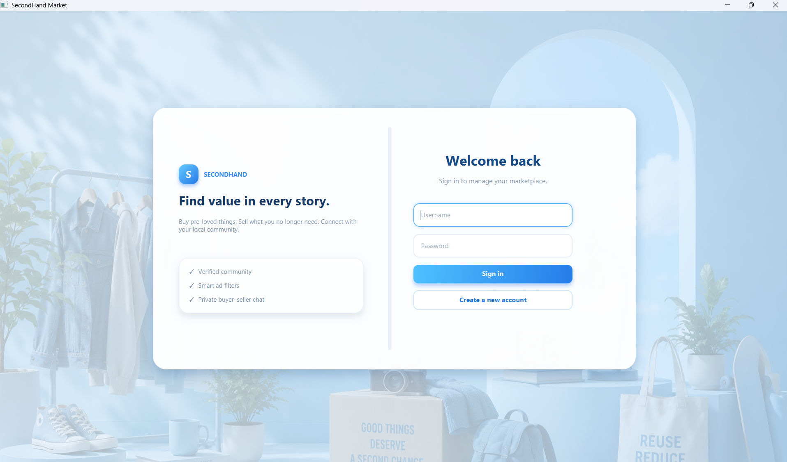
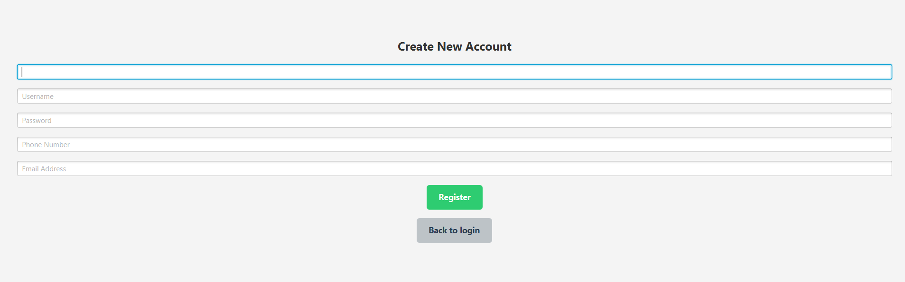
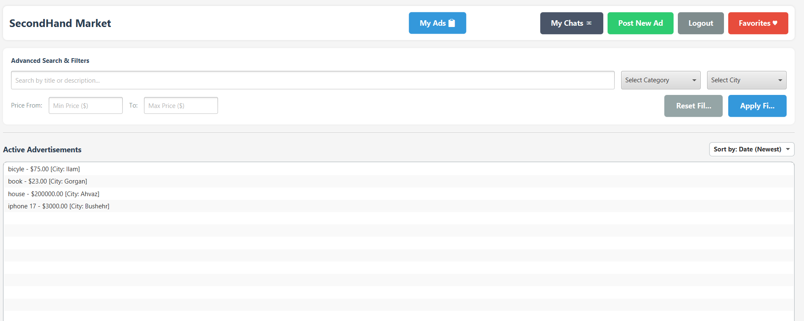
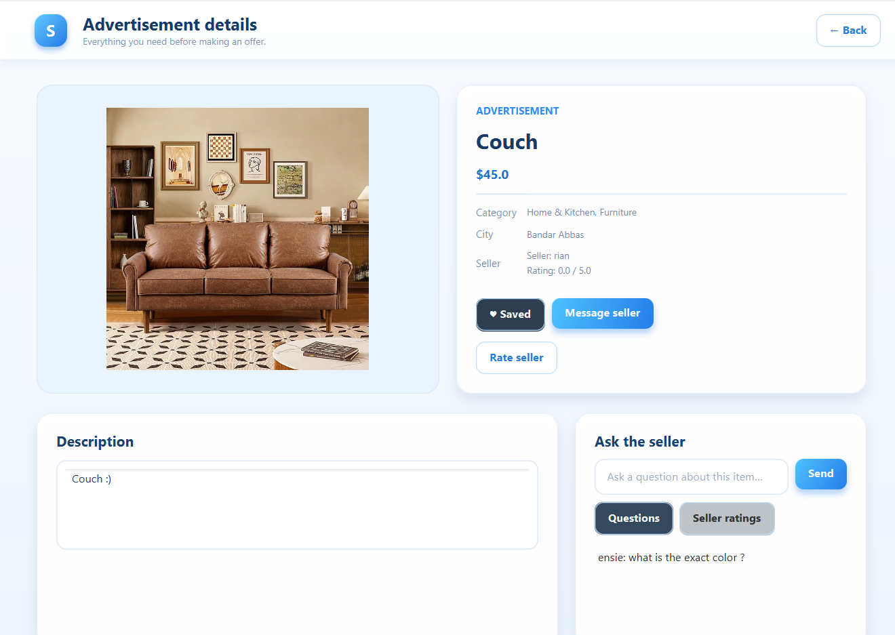
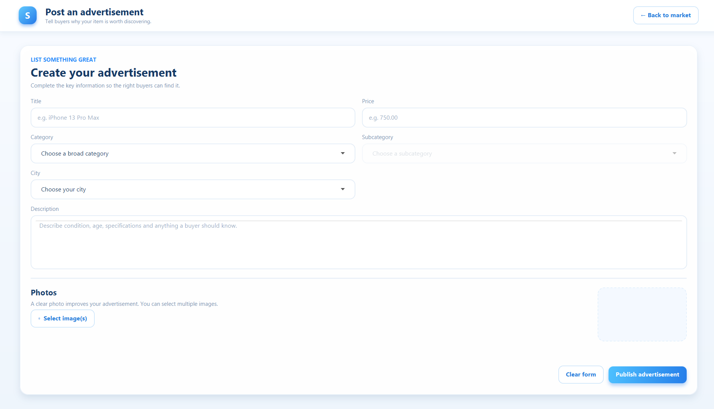
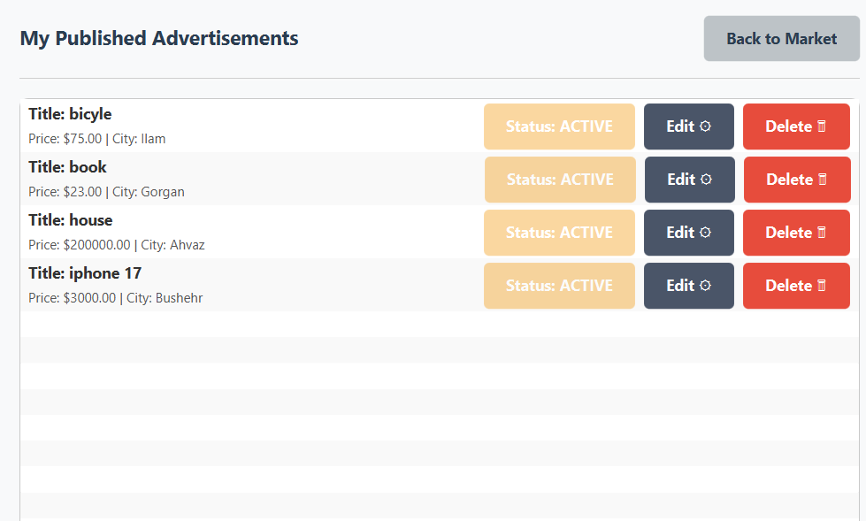
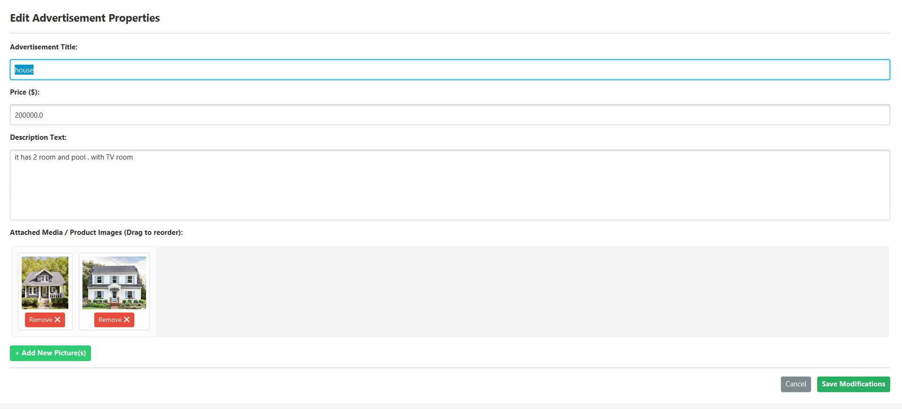
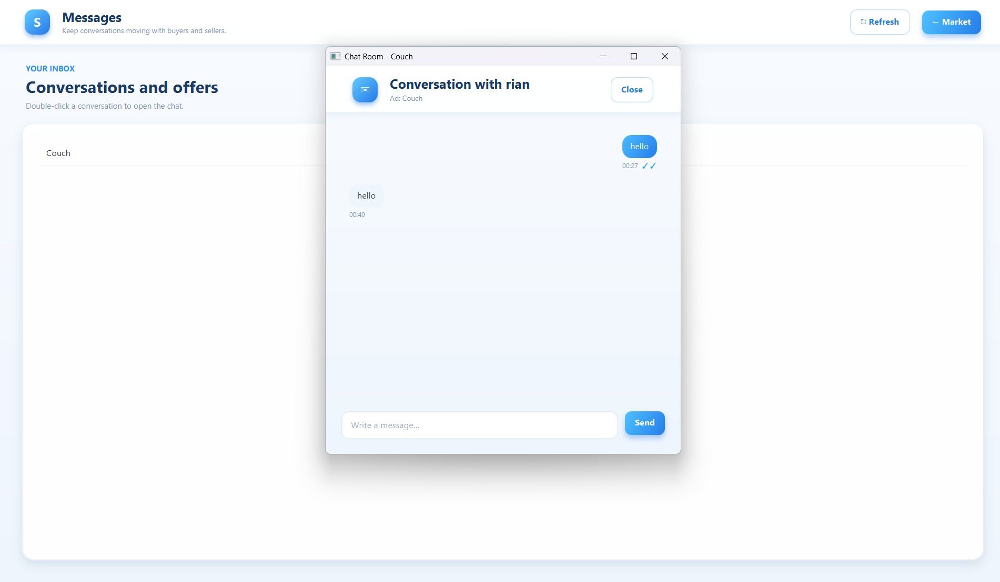
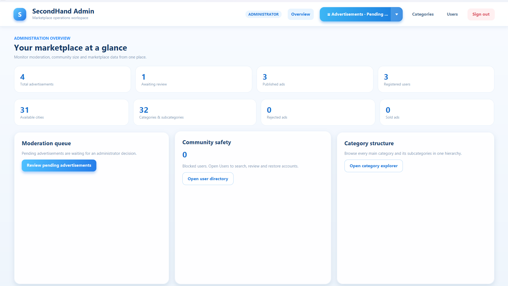

# SecondHand Marketplace

A modern desktop marketplace application built with **JavaFX** and **Spring Boot**, designed to provide a secure platform for buying and selling second-hand products.

The project follows a client-server architecture where the JavaFX frontend communicates with a RESTful Spring Boot backend secured using JWT authentication.

---

# Overview

SecondHand Marketplace allows users to publish advertisements, browse available products, communicate with sellers through a built-in chat system, manage favorite advertisements, and track their own listings.

Administrators have access to a dedicated management panel where they can review advertisements before publication, manage users, and maintain the overall integrity of the marketplace.

The project was developed as an educational software engineering project with emphasis on clean architecture, REST APIs, authentication, and desktop application development.

---

# Features

## User Features

* User Registration
* Secure Login using JWT Authentication
* Browse Marketplace Advertisements
* Search and View Advertisement Details
* Create New Advertisements
* Upload Multiple Images
* Edit Existing Advertisements
* Delete Advertisements
* View Personal Advertisements
* Add Advertisements to Favorites
* Remove Advertisements from Favorites
* Private Messaging Between Buyers and Sellers
* Inbox Management
* Automatic Chat Refresh
* Category Selection
* City Selection

---

## Administrator Features

* Administrator Login
* Review Pending Advertisements
* Approve Advertisements
* Reject Advertisements
* Delete Published Advertisements
* Block Users
* Unblock Users
* View Registered Users
* Marketplace Moderation

---

## Security Features

* JWT Authentication
* Password Encryption using BCrypt
* Stateless Authentication
* Protected REST APIs
* Role-Based Authorization
* Secure Request Filtering

---

# Technologies

## Backend

* Java
* Spring Boot
* Spring Security
* Spring Data JPA
* Hibernate
* JWT
* H2 Database
* Gradle
* Lombok

---

## Frontend

* JavaFX
* FXML
* Java HTTP Client
* Gson
* JSON

---

## Development Tools

* IntelliJ IDEA
* Git
* GitHub
* Scene Builder

---

# System Architecture

```
                +----------------------+
                |    JavaFX Frontend   |
                +----------+-----------+
                           |
                     HTTP REST API
                           |
                           ▼
                +----------------------+
                |  Spring Boot Backend |
                +----------+-----------+
                           |
                    Spring Security
                           |
                           ▼
                     JWT Authentication
                           |
                           ▼
                +----------------------+
                |      H2 Database     |
                +----------------------+
```

---

# Application Screenshots

The following screenshots demonstrate the main components of the application.

## Login



---

## Register




---

## Main Marketplace



---

## Advertisement Details



---

## Create Advertisement




---

## My Advertisements




---

## Edit Advertisement




---

## Inbox




---

## Administrator Panel




---

```
# Installation

## Prerequisites

Before running the project, make sure the following software is installed on your system:

* Java JDK 21 or later
* Gradle
* Git
* IntelliJ IDEA (Recommended)

---

# Clone Repository

```bash
git clone https://github.com/ensiebah/AP-project-.git
```

```bash
cd SecondHand
```

---

# Running the Backend

Navigate to the backend project and run:

```bash
./gradlew bootRun
```

or

```bash
gradlew bootRun
```

The backend server will start at:

```
http://localhost:8080
```

---

# Running the Frontend

Open the frontend project in IntelliJ IDEA.

Run:

```
FrontendApplication.java
```

The JavaFX desktop application will launch automatically.

---

# Default Database

The project uses the embedded **H2 Database** during development.

No external database installation is required.

When the backend starts for the first time, default marketplace categories and cities are automatically inserted into the database.

---

# Project Structure

```
SecondHand
│
├── backend
│   ├── config
│   ├── controller
│   ├── dto
│   ├── entity
│   ├── repository
│   ├── security
│   ├── service
│   ├── util
│   └── SecondHandApplication
│
├── frontend
│   ├── controller
│   ├── dto
│   ├── model
│   ├── network
│   ├── util
│   ├── view
│   └── FrontendApplication
│
├── images
│
├── README.md
│
└── build.gradle
```

---

# Backend Architecture

The backend follows a layered architecture.

```
Controller
     │
     ▼
Service
     │
     ▼
Repository
     │
     ▼
Database
```

Each layer has a dedicated responsibility which improves readability, maintainability, and scalability.

---

# Frontend Architecture

The desktop application follows the JavaFX MVC pattern.

```
FXML Views
      │
      ▼
Controllers
      │
      ▼
Network Client
      │
      ▼
REST API
```

Controllers are responsible for handling user interactions while the Network Client communicates with the backend server.

---

# Authentication

Authentication is implemented using **JSON Web Tokens (JWT).**

After a successful login:

1. The backend generates a JWT token.
2. The frontend stores the token.
3. Every protected request includes:

```
Authorization: Bearer <JWT_TOKEN>
```

The backend validates every incoming token before allowing access to protected resources.

---

# User Roles

The system supports two different user roles.

## User

Regular users can

* Register
* Login
* Browse advertisements
* Create advertisements
* Edit advertisements
* Delete advertisements
* Add favorites
* Send messages
* Receive messages

---

## Administrator

Administrators have full marketplace moderation permissions.

They can

* Review pending advertisements
* Approve advertisements
* Reject advertisements
* Delete advertisements
* Block users
* Unblock users
* Manage marketplace content

---

# REST API Overview

Some of the available endpoints include:

| Method | Endpoint                     | Description             |
| ------ | ---------------------------- | ----------------------- |
| POST   | `/api/users/register`        | Register new user       |
| POST   | `/api/users/login`           | User login              |
| GET    | `/api/advertisements`        | Browse advertisements   |
| POST   | `/api/advertisements/create` | Create advertisement    |
| PUT    | `/api/advertisements/{id}`   | Update advertisement    |
| DELETE | `/api/advertisements/{id}`   | Delete advertisement    |
| GET    | `/api/conversations`         | User conversations      |
| POST   | `/api/messages/send`         | Send message            |
| GET    | `/api/favorites`             | Favorite advertisements |

---

# Security

Security is implemented using Spring Security.

The application provides:

* JWT Authentication
* BCrypt Password Encryption
* Stateless Sessions
* Authorization Filters
* Role-Based Access Control
* Protected API Endpoints

Unauthorized requests are rejected before reaching business logic.

---

# Error Handling

The backend validates incoming requests before processing them.

Common validation includes:

* Empty input fields
* Invalid login credentials
* Unauthorized access
* Invalid advertisement data
* Invalid JWT tokens

Meaningful error responses are returned to the frontend whenever possible.

---

# Data Initialization

On application startup, the backend automatically inserts default marketplace data.

This includes:

* Marketplace Categories
* Major Iranian Cities

The initialization process prevents duplicate records from being inserted.
# Future Improvements

Although the current version provides a complete marketplace experience, several features can be added in future releases.

### Planned Features

* Product search with advanced filters
* Product image gallery with cloud storage
* User profile editing
* Password recovery via email
* Notification system
* Product reporting system
* Seller ratings and reviews
* Dark mode support
* Push notifications
* Multi-language support
* Online payment integration
* Product recommendation system
* AI-powered advertisement suggestions
* Admin dashboard analytics
* Docker deployment
* PostgreSQL production database
* Responsive Web Version

---

# Challenges

During development, several technical challenges were encountered.

Some of the most significant ones included:

* Designing a secure authentication system using JWT.
* Synchronizing JavaFX frontend with the Spring Boot backend.
* Managing multiple advertisement images.
* Implementing private messaging between users.
* Building role-based authorization for administrators.
* Keeping the application responsive while performing network operations.
* Organizing the project using a clean layered architecture.

These challenges helped improve understanding of Java backend development, desktop application design, REST APIs, and software architecture.

---

# Lessons Learned

This project provided practical experience in several software engineering concepts.

Key learning outcomes include:

* Building RESTful APIs using Spring Boot
* Designing layered software architecture
* Implementing authentication and authorization
* Working with relational databases
* Desktop application development using JavaFX
* JSON serialization and deserialization
* HTTP client communication
* MVC design pattern
* Git and GitHub version control
* Writing clean, maintainable Java code

---

# Performance

The application is designed to provide a responsive desktop experience.

Main optimizations include:

* Stateless authentication using JWT
* Asynchronous HTTP requests
* Automatic chat refresh
* Lightweight embedded database
* Efficient controller separation
* Modular project structure

---

# Repository Structure

```text
SecondHand Marketplace
│
├── Backend (Spring Boot)
│      ├── Controllers
│      ├── Services
│      ├── Repositories
│      ├── Security
│      ├── Entities
│      └── DTOs
│
├── Frontend (JavaFX)
│      ├── Controllers
│      ├── Views
│      ├── Models
│      ├── DTOs
│      ├── Network
│      └── Utilities
│
└── Documentation
       ├── README.md
       └── Images
```

---

## Authors

This project was developed as a university course project by:

- Ensie Bahrevar
GitHub:
https://github.com/ensiebah
- Reyhaneh Moradi
GitHub:
https://github.com/Rian-mk
Department of Computer Engineering  
Amirkabir University of Technology (Tehran Polytechnic)
---

# Acknowledgements

This project was developed as part of a university software engineering project.

Special thanks to:

* JavaFX Community
* Spring Boot Team
* Spring Security Team
* Gradle
* Gson Library
* H2 Database
* IntelliJ IDEA

for providing excellent tools and documentation.

---

# License

This project is released under the MIT License.

You are free to use, modify, and distribute this software under the terms of the license.

---

# Project Status

**Current Version**

Version **1.0**

Project Status:

**Completed**

Future maintenance and additional features may be added in upcoming versions.

---

# Contact

If you have any questions, suggestions, or feedback, feel free to open an Issue on GitHub.

Contributions and ideas are always welcome.

---

# Show Your Support

If you found this project useful, consider giving it a ⭐ on GitHub.

It helps others discover the project and encourages future improvements.

---

<p align="center">
  <b>Thank you for visiting this repository.</b>
  <br><br>
  Made with ❤️ using Java, JavaFX, and Spring Boot.
</p>

